# Трекінг ML-експериментів через MLflow з інтеграцією Prometheus та Grafana

## Зміст

- [Огляд проєкту](#огляд-проєкту)
- [Архітектура](#архітектура)
- [Передумови](#передумови)
- [Встановлення та налаштування](#встановлення-та-налаштування)
- [Запуск експериментів](#запуск-експериментів)
- [Перегляд результатів](#перегляд-результатів)
- [Структура проєкту](#структура-проєкту)
- [Скриншоти](#скриншоти)
- [Очищення ресурсів](#очищення-ресурсів)

---

## Огляд проєкту

Цей проєкт показує, як працює сучасний MLOps — від тренування моделі до її автоматичного розгортання:

- **Експерименти**: Тренування моделей класифікації на датасеті Iris з різними гіперпараметрами
- **Трекінг**: Логування параметрів, метрик та артефактів через MLflow
- **Моніторинг**: Візуалізація метрик у реальному часі через Prometheus та Grafana
- **Автоматизація**: Декларативне розгортання інфраструктури через ArgoCD та Helm
- **Оптимізація**: Автоматичний вибір та збереження найкращої моделі

**Ключові досягнення:**
- Натреновано 5 моделей з різними параметрами
- Всі метрики залоговані та доступні для аналізу
- Найкраща модель автоматично збережена для подальшого використання
- Інфраструктура повністю відтворювана

---

## Архітектура

```
┌─────────────────────────────────────────────────────────────┐
│                     Kubernetes Cluster                      │
│                                                             │
│  ┌──────────────┐  ┌──────────────┐  ┌─────────────────┐    │
│  │   MLflow     │  │  PostgreSQL  │  │     MinIO       │    │
│  │   Tracking   │◄─┤   Backend    │  │   Artifacts     │    │
│  │   Server     │  │   Store      │  │   Storage       │    │
│  └──────┬───────┘  └──────────────┘  └─────────────────┘    │
│         │                                                   │
│         │          ┌────────────────────────────────┐       │
│         │          │   Prometheus PushGateway       │       │
│         │          └───────────┬────────────────────┘       │
│         │                      │                            │
│  ┌──────▼──────────────────────▼─────────────────────┐      │
│  │              Prometheus Server                    │      │
│  └────────────────────────┬──────────────────────────┘      │
│                           │                                 │
│                  ┌────────▼────────┐                        │
│                  │     Grafana     │                        │
│                  └─────────────────┘                        │
│                                                             │
└─────────────────────────────────────────────────────────────┘
                           ▲
                           │
                  ┌────────┴────────┐
                  │  Python Script  │
                  │ train_and_push  │
                  └─────────────────┘
```

### Компоненти:

| Компонент | Призначення | Порт |
|-----------|-------------|------|
| **ArgoCD** | GitOps для декларативного розгортання | 30080 |
| **MLflow Tracking Server** | Трекінг експериментів, параметрів та моделей | 5000 |
| **PostgreSQL** | Backend store для метаданих MLflow | 5432 |
| **MinIO** | S3-сумісне сховище для артефактів моделей | 9000 |
| **Prometheus PushGateway** | Прийом метрик від скриптів | 9091 |
| **Prometheus Server** | Збір та зберігання метрик | 30091 |
| **Grafana** | Візуалізація та дашборди | 30300 |

---

## Передумови

### Необхідне програмне забезпечення:

- ✅ **Docker Desktop** (з увімкненим Kubernetes)
- ✅ **kubectl** (CLI для Kubernetes)
- ✅ **Helm 3.x** (менеджер пакетів для Kubernetes)
- ✅ **Terraform** (Infrastructure as Code)
- ✅ **Python 3.8+** (для скриптів тренування)

### Перевірка встановлення:

```bash
# Перевірте всі інструменти
docker --version
kubectl version --client
helm version
terraform version
python --version
```

---

## Встановлення та налаштування

### Крок 1: Підготовка проєкту

```bash
# Завантажте або клонуйте проєкт у вашу робочу директорію
cd /path/to/your/workspace
git clone <repository-url> mlops-experiments
cd mlops-experiments
```

> **Примітка:** У цій документації використовується позначення `./` для кореневої директорії проєкту. Замініть шляхи відповідно до вашої файлової системи.

### Крок 2: Розгортання ArgoCD через Terraform

```bash
# Перейдіть в директорію terraform
cd terraform

# Ініціалізуйте Terraform
terraform init

# Розгорніть ArgoCD
terraform apply
# Введіть 'yes' для підтвердження
```

**Отримання пароля для ArgoCD:**

**Linux/macOS:**
```bash
kubectl -n argocd get secret argocd-initial-admin-secret \
  -o jsonpath="{.data.password}" | base64 -d && echo
```

**Windows PowerShell:**
```powershell
kubectl -n argocd get secret argocd-initial-admin-secret `
  -o jsonpath="{.data.password}" | ForEach-Object { 
    [System.Text.Encoding]::UTF8.GetString([System.Convert]::FromBase64String($_)) 
  }
```

**Доступ до ArgoCD UI:**
- URL: https://localhost:30080
- Логін: `admin`
- Пароль: (отриманий з команди вище)

### Крок 3: Розгортання додатків через ArgoCD

```bash
# Поверніться в кореневу директорію проєкту
cd ..

# Розгорніть MinIO
kubectl apply -f argocd/applications/minio.yaml

# Розгорніть PostgreSQL
kubectl apply -f argocd/applications/postgres.yaml

# Розгорніть MLflow
kubectl apply -f argocd/applications/mlflow.yaml

# Розгорніть Pushgateway
kubectl apply -f argocd/applications/pushgateway.yaml

# Перевірте статус (всі мають бути Healthy and Synced)
kubectl get applications -n argocd

# Дочекайтесь готовності подів
kubectl get pods -n mlflow -w
# Натисніть Ctrl+C після того як всі поди стануть Running
```

### Крок 4: Встановлення Prometheus та Grafana через Helm

**Linux/macOS:**
```bash
# Додайте Helm репозиторії
helm repo add prometheus-community https://prometheus-community.github.io/helm-charts
helm repo add grafana https://grafana.github.io/helm-charts
helm repo update

# Встановіть Prometheus
helm install prometheus prometheus-community/prometheus \
  --namespace monitoring \
  --set server.service.type=NodePort \
  --set server.service.nodePort=30091 \
  --set alertmanager.enabled=false \
  --set prometheus-node-exporter.enabled=false \
  --set prometheus-pushgateway.enabled=false

# Встановіть Grafana
helm install grafana grafana/grafana \
  --namespace monitoring \
  --set adminPassword=admin123 \
  --set service.type=NodePort \
  --set service.nodePort=30300
```

**Windows PowerShell:**
```powershell
# Додайте Helm репозиторії
helm repo add prometheus-community https://prometheus-community.github.io/helm-charts
helm repo add grafana https://grafana.github.io/helm-charts
helm repo update

# Встановіть Prometheus
helm install prometheus prometheus-community/prometheus `
  --namespace monitoring `
  --set server.service.type=NodePort `
  --set server.service.nodePort=30091 `
  --set alertmanager.enabled=false `
  --set prometheus-node-exporter.enabled=false `
  --set prometheus-pushgateway.enabled=false

# Встановіть Grafana
helm install grafana grafana/grafana `
  --namespace monitoring `
  --set adminPassword=admin123 `
  --set service.type=NodePort `
  --set service.nodePort=30300
```

**Перевірка:**
```bash
# Дочекайтесь готовності
kubectl get pods -n monitoring -w
# Натисніть Ctrl+C після того як всі поди стануть Running
```

### Крок 5: Налаштування Prometheus для PushGateway

```bash
# Експортуйте конфігурацію Prometheus
kubectl get configmap prometheus-server -n monitoring -o yaml > prometheus-config.yaml
```

Відкрийте файл `prometheus-config.yaml` та додайте в секцію `scrape_configs`:

```yaml
    - job_name: pushgateway
      honor_labels: true
      static_configs:
        - targets:
          - pushgateway-prometheus-pushgateway.monitoring.svc.cluster.local:9091
```

Застосуйте зміни:

```bash
kubectl apply -f prometheus-config.yaml
kubectl rollout restart deployment prometheus-server -n monitoring
```

### Крок 6: Налаштування Grafana

Відкрийте Grafana за адресою: http://localhost:30300

**Додайте Prometheus Data Source:**
1. Перейдіть: **Connections** → **Data Sources** → **Add data source**
2. Виберіть **Prometheus**
3. URL: `http://prometheus-server.monitoring.svc.cluster.local`
4. Натисніть **Save & Test**

Має з'явитися: ✅ "Successfully queried the Prometheus API"

---

## Запуск експериментів

### Крок 1: Підготовка Python середовища

**Linux/macOS:**
```bash
# Перейдіть в директорію experiments
cd experiments

# Створіть віртуальне середовище
python3 -m venv venv

# Активуйте віртуальне середовище
source venv/bin/activate

# Встановіть залежності
pip install -r requirements.txt
```

**Windows PowerShell:**
```powershell
# Перейдіть в директорію experiments
cd experiments

# Створіть віртуальне середовище
python -m venv venv

# Активуйте віртуальне середовище
.\venv\Scripts\Activate.ps1

# Якщо помилка з ExecutionPolicy:
Set-ExecutionPolicy -ExecutionPolicy RemoteSigned -Scope CurrentUser

# Встановіть залежності
pip install -r requirements.txt
```

### Крок 2: Налаштування port-forwarding

**Відкрийте 3 окремі термінали:**

**Термінал 1 - MLflow:**
```bash
kubectl port-forward -n mlflow svc/mlflow 5000:5000
```

**Термінал 2 - MinIO:**
```bash
kubectl port-forward -n mlflow svc/minio 9001:9000
```

**Термінал 3 - PushGateway:**
```bash
kubectl port-forward -n monitoring svc/pushgateway-prometheus-pushgateway 9092:9091
```

### Крок 3: Запуск тренування

**Відкрийте 4-й термінал:**

```bash
# Перейдіть в директорію experiments
cd experiments

# Активуйте віртуальне середовище
# Linux/macOS:
source venv/bin/activate
# Windows:
.\venv\Scripts\Activate.ps1

# Запустіть скрипт
python train_and_push.py
```
**Якщо під час запуску з’являться помилки імпорту:**

(наприклад: ModuleNotFoundError: No module named 'mlflow' або No module named 'prometheus_client'),
встановіть ще раз необхідні бібліотеки вручну

```bash

pip install -r requirements.txt
```
або, якщо файл requirements.txt не спрацював — встановіть напряму:

```bash
pip install mlflow==2.13.1 scikit-learn==1.4.2 pandas==2.2.2 numpy==1.26.4 boto3==1.34.80 prometheus-client==0.20.0 requests==2.32.3 matplotlib seaborn
```

**Що робить скрипт:**
1. Завантажує датасет Iris (150 зразків, 4 ознаки, 3 класи). Додає випадковий шум до даних, щоб зробити експеримент реалістичнішим. Для кожного запуску використовується випадковий random_state, тому результати трохи відрізняються.
2.   Тренує 5 моделей Random Forest з різними параметрами:
   - Модель 1: n_estimators=50, max_depth=3
   - Модель 2: n_estimators=100, max_depth=5
   - Модель 3: n_estimators=150, max_depth=7
   - Модель 4: n_estimators=200, max_depth=10
   - Модель 5: n_estimators=100, max_depth=None
3.   Логує для кожної моделі:
   - Параметри в MLflow
   - Метрики (accuracy, loss) в MLflow
   - Метрики в Prometheus через PushGateway
   - Артефакти (сама модель і зображення матриці плутанини (Confusion Matrix) у форматі .png)
4. Автоматично визначає найкращу модель за accuracy
5. Копіює найкращу модель в директорію `best_model/`
6. Виводить результати в консоль і підказує, де їх переглянути

**Очікуваний вивід:**
```
================================================================================
Початок експериментів з MLflow + Prometheus
================================================================================

[1/4] Завантаження датасету Iris...

[2/4] Тренування 5 моделей...
--------------------------------------------------------------------------------

Експеримент 1/5:
✓ Використано random_state=5821
Run ID: bffde8016dbf4c4583bfcf4cacf69f49
  Parameters: n_estimators=50, max_depth=3, lr=0.01
  Accuracy: 0.9167
  Loss: 0.2666
✓ Метрики відправлені в PushGateway для run_id: bffde8016dbf4c4583bfcf4cacf69f49

...

--------------------------------------------------------------------------------
✓ Всі моделі натреновані!

[3/4] Пошук найкращої моделі...

================================================================================
НАЙКРАЩА МОДЕЛЬ:
================================================================================
Run ID: 650f6f8c24824ef9838efe8218b7f90f
Accuracy: 0.9667
Loss: 0.1549
Parameters:
  - n_estimators: 100
  - max_depth: None
  - learning_rate: 0.1
================================================================================

[4/4] Копіювання найкращої моделі...
✓ Найкраща модель збережена в ../best_model

================================================================================
ЕКСПЕРИМЕНТИ ЗАВЕРШЕНО УСПІШНО!
================================================================================

Наступні кроки:
1. Перегляньте експерименти в MLflow UI: http://localhost:5000
2. Перегляньте метрики в Grafana: http://localhost:30300
3. Найкраща модель збережена в директорії: ../best_model/
```

---

## Перегляд результатів

### 1. MLflow UI

Відкрийте браузер: http://localhost:5000

**Що переглянути:**
- Експеримент "iris-classification" з 5 запусками
- Порівняння метрик (accuracy, loss) між запусками
- Параметри кожної моделі
- Артефакти (збережені моделі)

### 2. Grafana

Відкрийте браузер: http://localhost:30300

**Перегляд метрик:**
1. Перейдіть: **Explore** (іконка компаса)
2. Виберіть Data Source: **Prometheus**
3. Метрики для перегляду:
   - `mlflow_accuracy` - точність всіх моделей
   - `mlflow_loss` - loss всіх моделей
4. Натисніть **Run query**

**Можливості:**
- Графіки метрик по часу
- Фільтрація по run_id
- Табличний вигляд
- Порівняння запусків

### 3. Prometheus UI

Відкрийте браузер: http://localhost:30091

**Перевірте:**
- Targets: PushGateway має бути UP
- Запити: `mlflow_accuracy`, `mlflow_loss`

### 4. PushGateway UI

Відкрийте браузер: http://localhost:9092

**Переглядайте:**
- Всі відправлені метрики
- Мітки (run_id для кожного експерименту)

### 5. Найкраща модель

```bash
# Перегляньте вміст директорії з найкращою моделлю
cd best_model
ls -la
```

**Файли моделі:**
- `MLmodel` - метаінформація
- `conda.yaml` - залежності
- `model.pkl` - серіалізована модель
- `python_env.yaml` - Python середовище
- `requirements.txt` - Python пакети

---

## Структура проєкту

```
mlops-experiments/
│
├── argocd/                          # ArgoCD Applications
│   └── applications/
│       ├── mlflow.yaml              # MLflow Tracking Server
│       ├── minio.yaml               # MinIO для артефактів
│       └── postgres.yaml            # PostgreSQL для метаданих
│       └── pushgateway.yaml         # Pushgateway
│
├── terraform/                       # Infrastructure as Code
│   └── main.tf                      # Terraform конфігурація для ArgoCD
│
├── experiments/                     # ML експерименти
│   ├── train_and_push.py            # Основний скрипт тренування
│   └── requirements.txt             # Python залежності
│
├── best_model/                      # Найкраща модель (автогенерується)
│   ├── .gitkeep
│   ├── MLmodel
│   ├── conda.yaml
│   ├── model.pkl
│   ├── python_env.yaml
│   └── requirements.txt
│
├── screenshots/                     # Скриншоти для звіту
│   └── 01-argocd-dashboard.jpg
│   ...
│
└── README.md                        # Цей файл
```

---

## Скриншоти

### 1. ArgoCD Dashboard
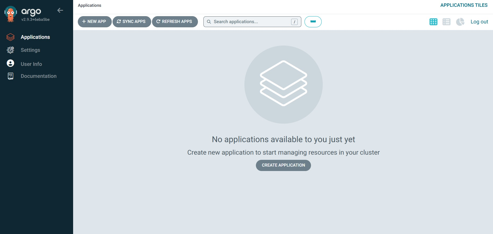
*Dashboard з порожнім списком applications*

### 2. MLflow UI (порожній)
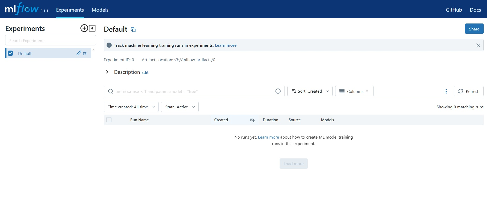
*MLflow UI перед запуском експериментів*

### 3. Grafana Data Source
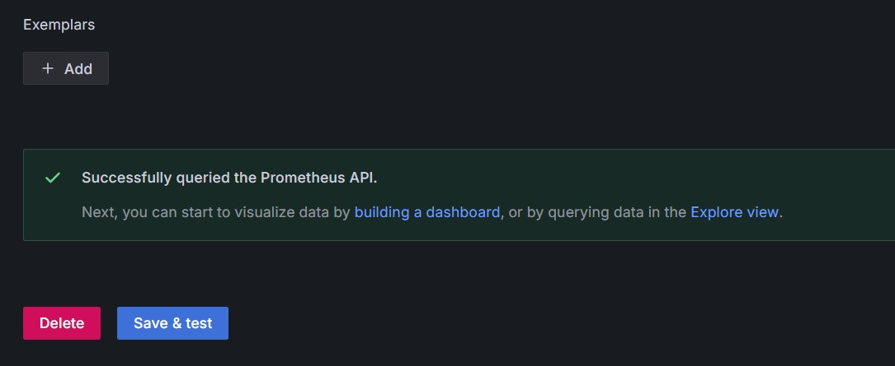
*Успішно підключений Prometheus Data Source*

### 4. ArgoCD Applications (Healthy)
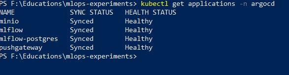
*Всі applications в статусі Healthy and Synced*

### 5. Вивід скрипту тренування
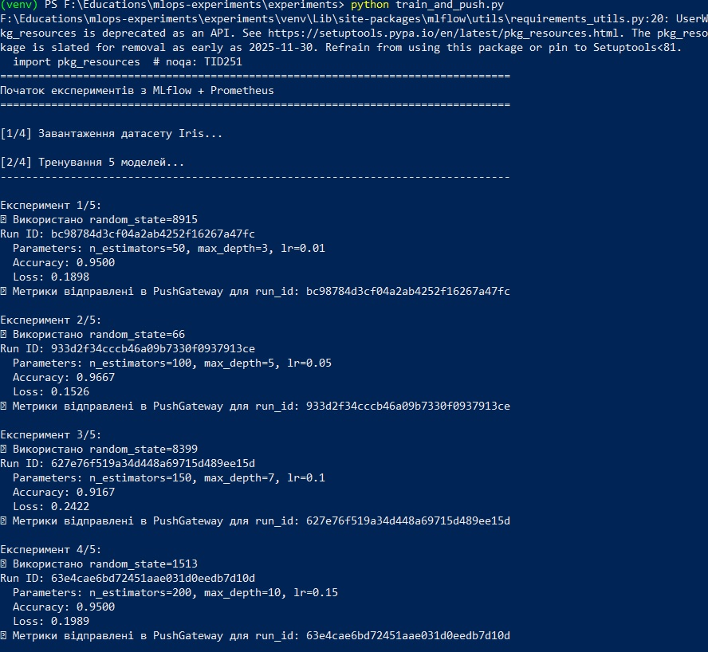

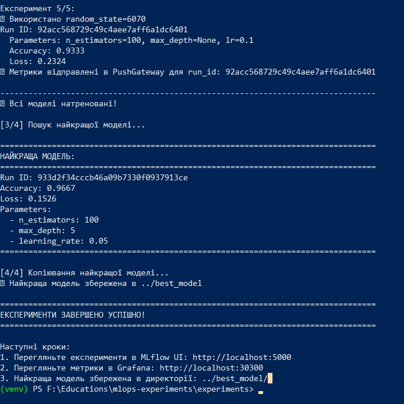
*Результати виконання train_and_push.py з 5 експериментами*

### 6. MLflow - Список експериментів
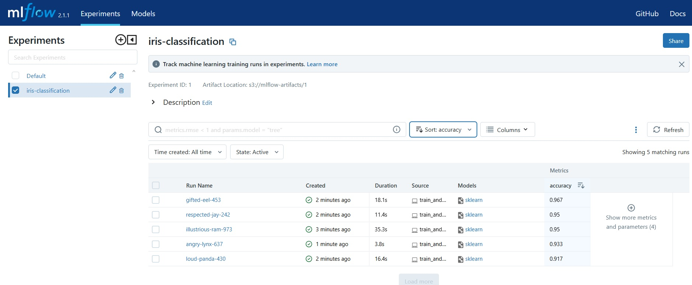
*5 запусків з різними параметрами та метриками*

### 7. MLflow - Найкращий запуск
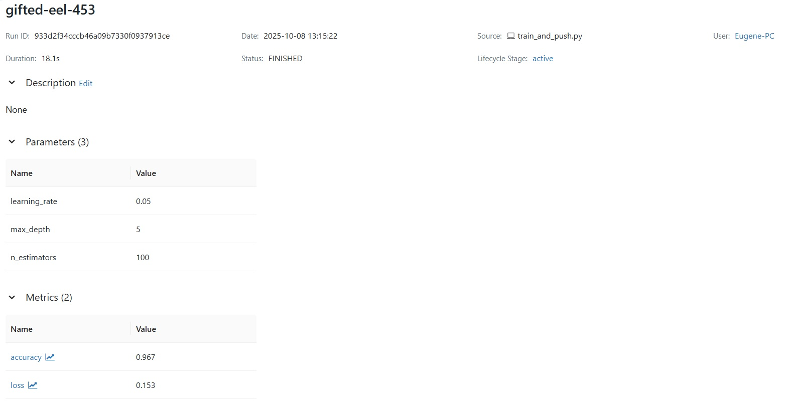

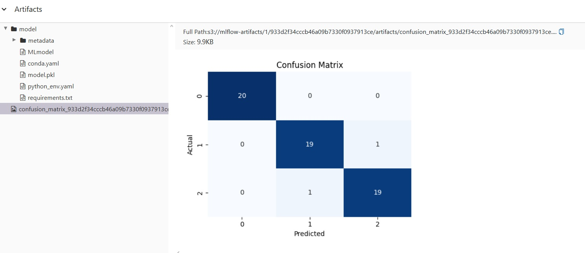
*Деталі найкращої моделі: параметри, метрики, артефакти*

### 8. PushGateway - Метрики
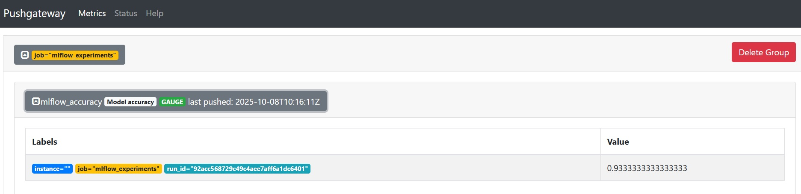

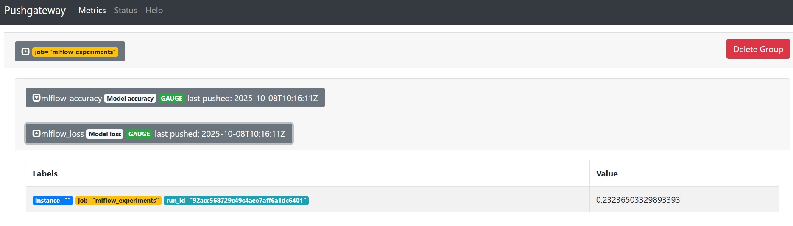
*Метрики mlflow_accuracy та mlflow_loss в PushGateway*

### 9. Grafana - Accuracy
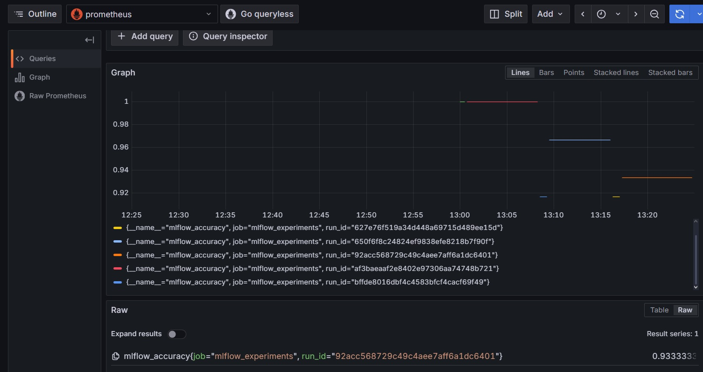
*Метрика mlflow_accuracy в Grafana Explore*

### 10. Grafana - Loss
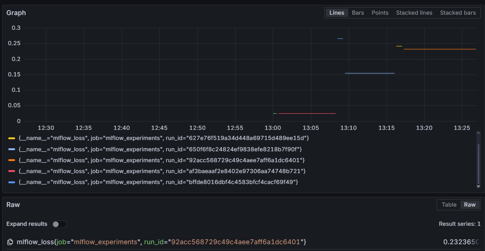
*Метрика mlflow_loss в Grafana Explore*

### 11. Best Model Files
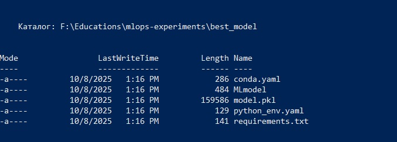
*Вміст директорії best_model/ з найкращою моделлю*

---

## Очищення ресурсів

### Видалення всієї інфраструктури

```bash
# 1. Видаліть ArgoCD Applications
kubectl delete -f argocd/applications/mlflow.yaml
kubectl delete -f argocd/applications/minio.yaml
kubectl delete -f argocd/applications/postgres.yaml
kubectl delete -f argocd/applications/pushgateway.yaml

# 2. Видаліть Helm releases
helm uninstall prometheus -n monitoring
helm uninstall grafana -n monitoring

# 3. Видаліть namespaces
kubectl delete namespace mlflow
kubectl delete namespace monitoring

# 4. Видаліть ArgoCD через Terraform
cd terraform
terraform destroy
# Введіть 'yes' для підтвердження

# 5. Видаліть namespace argocd
kubectl delete namespace argocd
```

### Очищення локальних файлів

**Linux/macOS:**
```bash
# Видаліть віртуальне середовище
rm -rf experiments/venv

# Видаліть Terraform файли
rm -rf terraform/.terraform
rm -f terraform/terraform.tfstate*

# Видаліть згенеровані файли
rm -f prometheus-config.yaml

# Очистіть best_model (залишіть .gitkeep)
cd best_model
find . -type f -not -name '.gitkeep' -delete
```

**Windows PowerShell:**
```powershell
# Видаліть віртуальне середовище
Remove-Item -Recurse -Force experiments\venv

# Видаліть Terraform файли
Remove-Item -Recurse -Force terraform\.terraform
Remove-Item terraform\terraform.tfstate*

# Видаліть згенеровані файли
Remove-Item prometheus-config.yaml

# Очистіть best_model
Get-ChildItem best_model | Remove-Item -Recurse -Force
```

---

## Що зроблено після виконання усіх пунктів?

- Розгорнуто повну MLOps-інфраструктуру в середовищі Kubernetes
- Впроваджено GitOps-підхід із використанням ArgoCD
- Налаштовано MLflow для трекінгу експериментів і збереження артефактів
- Інтегровано Prometheus і Grafana для моніторингу метрик моделей
- Реалізовано автоматизацію ML-пайплайнів із логуванням у PushGateway
- Використано Helm-чарти для декларативного розгортання сервісів
- Налаштовано інфраструктуру через Terraform
- Проведено налагодження подів і застосунків у кластері Kubernetes

---